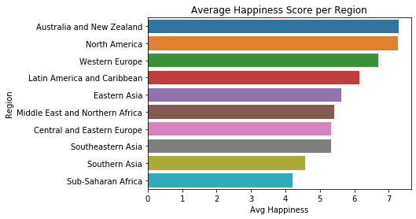

# World-Happinesss-Report-Analysis

An analysis of the world happiness report created by the UN sustainable Development Solutions Network analysing aspects such as family, freedom generosity and corruption with the aim of:
- Getting more insight on the aggregate happiness scores across the world’s regions
- Determining change in happiness levels from 2015 to 2017
- Determining factors greatly contributing to happiness scores

General Summary of Findings:

Australia & New Zealand, and North America are the regions with the highest average happiness scores while Sub-saharan Africa and Southern Asia are the regions with the lowest average happiness scores.

The regions with the highest GDP are North America, Western Europe, and Australia, and New Zealand all ranging between 1.2 - 1.3. The regions with the lowest average GDP levels are Sub- Saharan Africa, Southern Asia with an average GDP score lower than 0.6.

The regions with the highest Life Expectancy are Australia and New Zealand, Western Europe North America, and East Asia all ranging between 0.7 - 0.9. The regions with the lowest average Life Expectancy levels are Sub- Saharan Africa (0.28), Southern Asia (0.55), all with an average GDP score lower than 0.6.

The regions where citizens have the highest levels of freedom are Australia and New Zealand, North America, Southeastern Asia, and Western Europe all ranging between 0.55 - 0.65. The regions with the lowest levels of freedom are Central and Eastern Europe and the Middle East and Northern Africa, Sub-Saharan Africa, and Southern Asia, all with scores between 0.35 -0.37.

Other than Dystopia residual, the factors that greatly influence happiness scores are Family and Economy (GDP per Capita) at relatively equal proportion, followed by Health, Freedom, Generosity, and Trust in Government/Government corruption levels.

The regions where citizens have the highest levels of freedom are Australia and New Zealand, North America, which  are also the regions with the highest happines scores. The regions with the lowest levels of freedom are Central and Eastern Europe and the Middle East and Northern Africa, Sub-Saharan Africa, and Southern Asia, and happen to be regions with lower happiness levels.

